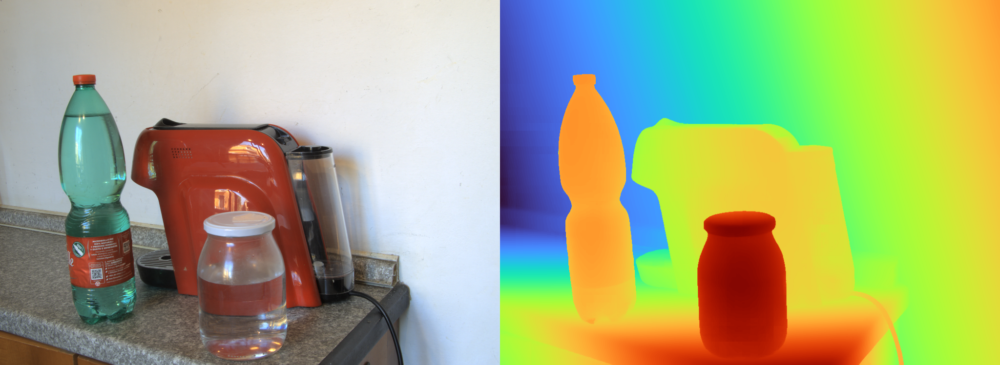

# BridgeDepth

Official implementation of paper:

[**BridgeDepth: Bridging Monocular and Stereo Reasoning with Latent Alignment**](https://www.arxiv.org/abs/2508.04611), **ICCV 2025**<br/>
Tongfan Guan, Jiaxin Guo, Chen Wang, Yun-Hui Liu<br/>

# Abstract
Monocular and stereo depth estimation offer complementary strengths: monocular methods capture rich contextual priors but lack geometric precision, while stereo approaches leverage epipolar geometry yet struggle with ambiguities such as reflective or textureless surfaces. Despite post-hoc synergies, these paradigms remain largely disjoint in practice. We introduce a unified framework that bridges both through iterative bidirectional alignment of their latent representations. At its core, a novel cross-attentive alignment mechanism dynamically synchronizes monocular contextual cues with stereo hypothesis representations during stereo reasoning. This mutual alignment resolves stereo ambiguities (e.g., specular surfaces) by injecting monocular structure priors while refining monocular depth with stereo geometry within a single network. Extensive experiments demonstrate state-of-the-art results: **it reduces zero-shot generalization error by `>40%` on Middlebury and ETH3D**, while addressing longstanding failures on transparent and reflective surfaces. By harmonizing multi-view geometry with monocular context, our approach enables robust 3D perception that transcends modality-specific limitations.


**TLDR**: A unified framework combines monocular and stereo depth estimation through iterative bidirectional alignment of latent representations, achieving state-of-the-art results and addressing ambiguities in stereo vision.

## Get Started

### Installation

1. Clone BridgeDepth
```bash
git clone https://github.com/aeolusguan/BridgeDepth
cd BridgeDepth
```

2. Create the environment, here we recommend using conda.
```bash
conda create -n bridgedepth python=3.10
conda activate bridgedepth
pip install torch==2.7.0 torchvision==0.22.0 --index-url https://download.pytorch.org/whl/cu126  # use the correct version of cuda for your system
pip install -r requirement.txt
# Optional, but recommend (~30% faster)
pip install xformers==0.0.30 --index-url https://download.pytorch.org/whl/cu126  # use the correct version of cuda for your system
```

### Checkpoints

We provide several pre-trained models:


| Model name | Benchmark | Training resolutions | Stereo encoder | Training Config |
|------------|-----------|----------------------|----------------|-----------------|
| [`sf.pth`](https://huggingface.co/aeolusguan/BridgeDepth/resolve/main/bridge_sf.pth) | Scene Flow | 368x784 | BasicEncoder | [`default.py`](bridgedepth/config/default.py) |
| [`l_sf.pth`](https://huggingface.co/aeolusguan/BridgeDepth/resolve/main/bridge_l_sf.pth) | Scene Flow | 368x784 | ConvNext-Tiny | [`l_train.yaml`](configs/L_train.yaml) |
| [`kitti.pth`](https://huggingface.co/aeolusguan/BridgeDepth/resolve/main/bridge_kitti.pth) | KITTI 2012/2015 | 304x1152 |ConvNext-Tiny | [`kitti_mix_train.yaml`](configs/kitti_mix_train.yaml) |
|[`eth3d_pretrain.pth`](https://huggingface.co/aeolusguan/BridgeDepth/resolve/main/bridge_eth3d_pretrain.pth),  [`eth3d.pth`](https://huggingface.co/aeolusguan/BridgeDepth/resolve/main/bridge_eth3d.pth)  | ETH3D | 384x512 | ConvNext-Tiny | [`eth3d_pretrain.yaml`](configs/eth3d_pretrain.yaml), [`eth3d.yaml`](configs/eth3d.yaml) |
| [`middlebury_pretrain.pth`](https://huggingface.co/aeolusguan/BridgeDepth/resolve/main/bridge_middlebury_pretrain.pth), [`middlebury.pth`](https://huggingface.co/aeolusguan/BridgeDepth/resolve/main/bridge_middlebury.pth) | Middlebury | 384x512, 512x768 | ConvNext-Tiny | [`middlebury_pretrain.yaml`](configs/middlebury_pretrain.yaml), [`middlebury.yaml`](configs/middlebury.yaml) |
| [`rvc_pretrain.pth`](https://huggingface.co/aeolusguan/BridgeDepth/resolve/main/bridge_rvc_pretrain.pth), [`rvc.pth`](https://huggingface.co/aeolusguan/BridgeDepth/resolve/main/bridge_rvc.pth) | Robust Vision Challenge | 384x768, 384x768 | ConvNext-Tiny | [`rvc_pretrain.yaml`](configs/rvc_pretrain.yaml), [`rvc.yaml`](configs/rvc.yaml) |


### Run demo
```bash
python demo.py --model_name rvc_pretrain  # also try with [rvc | eth3d_pretrain | middlebury_pretrain]
```

You can see output disparity visualization
<p align="center">
  
</p>

Point cloud output (**without denoising**)
<p align="center">
  
</p>

### Inference
To test on your own stereo image pairs, placed at `$left_directory` and `$right_direcoty` respectively
```bash
python infer.py --input $left_directory $right_directory --output $output_directory --from-pretrained rvc_pretrain # also try with [rvc | eth3d_pretrain | middlebury_pretrain]
```

Tips:
- For in the wild deployment, we generally recommend the [`rvc_pretrain.pth`](https://huggingface.co/aeolusguan/BridgeDepth/resolve/main/bridge_rvc_pretrain.pth) checkpoint. You are encouraged to also try other models for your best fit ([`middlebury_pretrain.pth`](https://huggingface.co/aeolusguan/BridgeDepth/resolve/main/bridge_middlebury_pretrain.pth), [`eth3d_pretrain.pth`](https://huggingface.co/aeolusguan/BridgeDepth/resolve/main/bridge_eth3d_pretrain.pth), or [`rvc.pth`](https://huggingface.co/aeolusguan/BridgeDepth/resolve/main/bridge_rvc.pth) maybe your favorite).
- For high-resolution image (>720p), you are highly suggested to run with smaller scale, e.g., **downsampled to 720p**, not only for faster inference but also better performance.

## Datasets
To train/evaluate _BridgeDepth_, you first need to prepare datasets following [this guide](bridgedepth/dataloader/README.md).

## Evaluation
To evaluate on SceneFlow test set, run
```bash
python main.py --num-gpus 4 --eval-only --from-pretrained sf  # use the number of gpus for your need
# or
python main.py --num-gpus 4 --eval-only --from-pretrained l_sf
```
For zero-shot generalization evaluation
```bash
python main.py --num-gpus 4 --eval-only --config-file configs/zero_shot_evaluation.yaml --from-pretrained sf
```
For submission to KITTI 2012/2015, ETH3D, and Middlebury online test sets, you can run:
```bash
python infer.py --dataset-name kitti_2015 --from-pretrained kitti  # produce kitti_2015_submission in current working directory
python infer.py --dataset-name kitti_2012 --from-pretrained kitti  # produce kitti_2012_submission in current working directory
python infer.py --dataset-name eth3d --output eth3d_submission --from-pretrained eth3d  # try with --from-pretrained rvc for _RVC submission
python infer.py --dataset-name middlebury_H --output middlebury_submission --from-pretrained middlebury # try with --from-pretrained rvc for _RVC submission
```

## Training

First, download DAv2 models
```bash
mkdir checkpoints; cd checkpoints
wget https://huggingface.co/depth-anything/Depth-Anything-V2-Large/resolve/main/depth_anything_v2_vitl.pth
cd ..
```

### Train on SceneFlow
```bash
python main.py --num-gpus 4 --checkpoint-dir checkpoints/sf
python main.py --num-gpus 4 --config-file configs/L_train.yaml --checkpoint-dir checkpoints/l_sf
```

### Finetune for Benchmarks

```bash
# KITTI
python main.py --num-gpus 4 --config-file configs/kitti_mix_train.yaml --checkpoint-dir checkpoints/kitti SOLVER.RESUME checkpoints/l_sf/step_300000.pth
# ETH3D
python main.py --num-gpus 4 --config-file configs/eth3d_pretrain.yaml --checkpoint-dir checkpoints/eth3d_pretrain SOLVER.RESUME checkpoints/l_sf/step_300000.pth
python main.py --num-gpus 4 --config-file configs/eth3d.yaml --checkpoint-dir checkpoints/eth3d SOLVER.RESUME checkpoints/eth3d_pretrain/step_300000.pth
# Middlebury
python main.py --num-gpus 4 --config-file configs/middlebury_pretrain.yaml --checkpoint-dir checkpoints/middlebury_pretrain SOLVER.RESUME checkpoints/l_sf/step_300000.pth
python main.py --num-gpus 4 --config-file configs/middlebury.yaml --checkpoint-dir checkpoints/middlebury SOLVER.RESUME checkpoints/middlebury_pretrain/step_200000.pth
# RVC
python main.py --num-gpus 4 --config-file configs/rvc_pretrain.yaml --checkpoint-dir checkpoints/rvc_pretrain SOLVER.RESUME checkpoints/l_sf/step_300000.pth
python main.py --num-gpus 4 --config-file configs/rvc.yaml --checkpoint-dir checkpoints/rvc SOLVER.RESUME checkpoints/rvc_pretrain/step_200000.pth
```

We support using tensorboard to monitor the training process. You can first start a tensorboard session with

```shell
tensorboard --logdir checkpoints
```

and then access [http://localhost:6006](http://localhost:6066) in your browser.

## BibTex
```bibtex
@article{guan2025bridgedepth,
  title={BridgeDepth: Bridging Monocular and Stereo Reasoning with Latent Alignment},
  author={Guan, Tongfan and Guo, Jiaxin and Wang, Chen and Liu, Yun-Hui},
  journal={arXiv preprint arXiv:2508.04611},
  year={2025}
}
```

## Acknowledgement
Thanks to the authors of [DepthAnything V2](https://github.com/DepthAnything/Depth-Anything-V2), [NMRF](https://github.com/aeolusguan/NMRF), [DEFOM-Stereo](https://github.com/Insta360-Research-Team/DEFOM-Stereo) and [FoundationStereo](https://github.com/NVlabs/FoundationStereo) for their code release. Finally, thanks to ICCV reviewers and AC for their appreciation of this work and constructive feedback.
